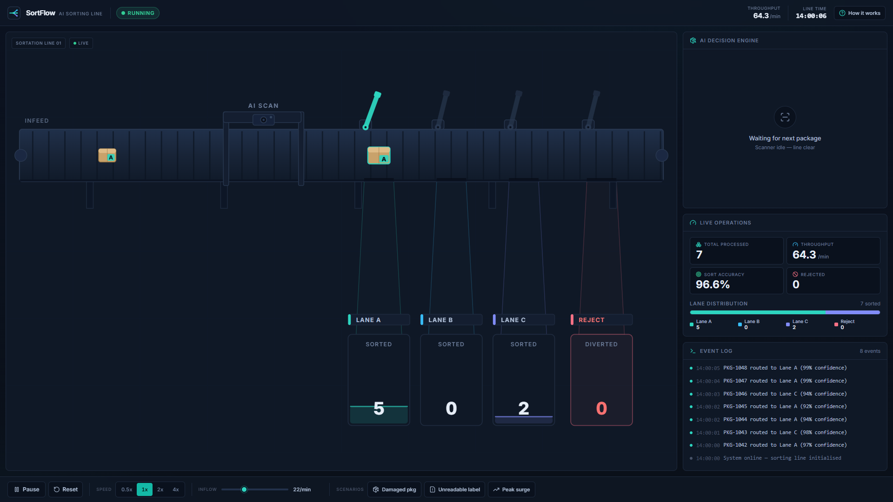
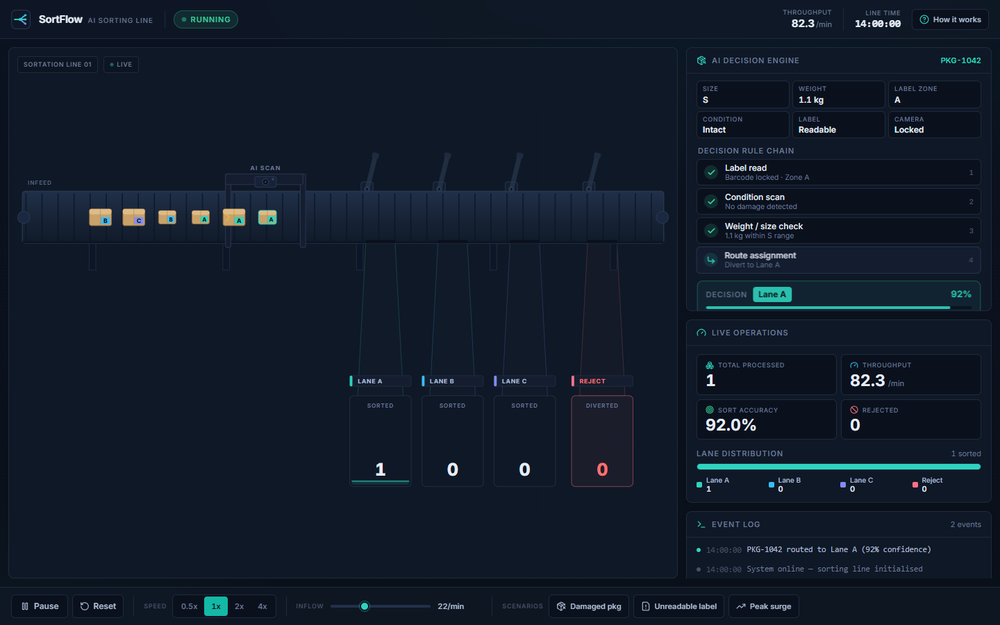
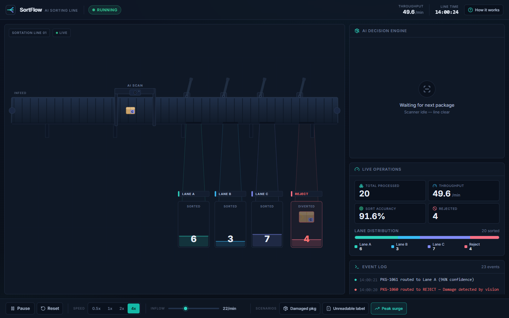

# SortFlow

**An AI-powered smart package sorting line — a live, browser-based Industry 4.0 simulation.**

SortFlow visualises the core Industry 4.0 control loop — **Sense → Decide → Act → Report** — as a working warehouse sortation line. Packages ride an animated conveyor, a scanning station reads each one, a transparent AI rule engine classifies it in real time and assigns a lane, robotic diverters push it into the right bin, and every machine reports live to an operations dashboard.

Everything runs client-side. No backend, no database, no API keys. It deploys to Vercel with zero configuration.



---

## Screenshots

| The decision engine, step by step | Scenarios & stress testing |
| --- | --- |
|  |  |

The AI panel steps through the **exact, visible rule chain** for the package under the scanner, then shows the final routing decision and confidence — and that decision always matches where the package physically goes.

---

## How it works

Each package spawns at the left of the belt with randomised attributes: a short id (`PKG-1042`), a size (S/M/L), a weight correlated with size, a printed destination-zone label (A/B/C), a condition (intact or ~8% damaged) and a label-readable flag (~4% unreadable).

Packages travel right. At the scanning station the belt pauses each package briefly, a scan effect plays, and the AI decision engine evaluates it against a fixed, visible rule chain:

1. **Label readable?** If not → **REJECT** — _"Unreadable label, needs manual handling"._
2. **Condition check** — damaged? If so → **REJECT** — _"Damage detected by vision system"._
3. **Weight vs size sanity check** — weight far outside the expected band for the size → **REJECT** — _"Weight mismatch, possible mislabel"._
4. Otherwise **route by destination zone** to **Lane A**, **Lane B** or **Lane C**.

Each decision carries a confidence score (92–99% for clean reads, 70–90% for edge cases). After the decision the package is released, a diverter arm swings out at the correct gate, and it drops into its lane bin. Rejected packages divert into a visually distinct amber/red reject chute.

### The four stations

- **Sense** — a vision camera and load sensors read the package at the scan gantry.
- **Decide** — a rule-based engine runs the transparent check chain and assigns a lane + confidence.
- **Act** — a robotic diverter arm pushes the package off the belt into its lane (or the reject chute).
- **Report** — counts, throughput, sort accuracy and a full event log update live and reconcile exactly.

### A note on the metrics

- **Total processed / lane counts / rejected** are committed atomically the instant a package is sorted, so the KPI tiles, the lane distribution bar, the bin counters and the event log **always reconcile exactly** (`total = A + B + C + Reject`).
- **Throughput** is packages-per-minute over a trailing 60-second window (extrapolated before the window fills).
- **Sort accuracy** is a rolling (exponential-moving-average) sort-quality index derived from the per-decision confidence scores. It sits high, dips when you stress the line with damaged/unreadable packages, and recovers over time — a live, honest number rather than a flat 100%.

---

## Controls & scenarios

- **Start / Pause**, **Reset**, and a **speed** control (0.5× / 1× / 2× / 4×).
- **Inflow** slider — packages per minute.
- **Scenarios:**
  - **Damaged pkg** — the next spawned package is damaged (→ reject on the condition rule).
  - **Unreadable label** — the next spawned package has an unreadable label (→ reject on the label rule).
  - **Peak surge** — doubles the inflow rate for 20 seconds, with a live countdown.
- **How it works** — an in-app modal that explains the Sense/Decide/Act/Report loop for first-time viewers.

The simulation respects `prefers-reduced-motion`: decorative animation (belt texture, scan-beam sweep, pulses) is disabled while functional package movement is preserved.

---

## Tech stack

- **Vite + React 18 + TypeScript** (strict mode)
- **Tailwind CSS** for styling, with a small custom control-room theme
- **Inline SVG** for the conveyor scene, animated with a single `requestAnimationFrame` loop (never CSS transitions for per-frame position)
- **lucide-react** for icons — no emoji anywhere
- **@fontsource-variable/inter** for typography (self-hosted, no CDN)

Zero other runtime dependencies.

### Architecture

The simulation logic is a **pure TypeScript module** with no React or DOM imports, kept separate from rendering:

```
src/
  sim/
    engine.ts        Pure engine: object pool, scanner queue, phase state
                     machine, rule chain, stats, scenarios, throughput/accuracy
    layout.ts        Virtual-canvas geometry + motion tuning (shared by engine
                     and scene, so decisions/diverters always line up)
    types.ts         Shared data contracts
  hooks/
    useSimulation.ts RAF loop that drives the engine into React
    useReducedMotion.ts
  components/
    ConveyorScene.tsx   Animated SVG line (belt, scanner, lanes, diverters, packages)
    DecisionPanel.tsx   The AI rule chain + final decision
    Dashboard.tsx       KPI tiles + lane distribution bar
    EventLog.tsx        Timestamped, reconciled event stream
    ControlBar.tsx      Transport, speed, inflow, scenarios
    Header.tsx          Wordmark, status, throughput, clock
    HowItWorksModal.tsx
    Logo.tsx
  lib/
    palette.ts       Hex colours mirroring the Tailwind theme (for SVG)
    format.ts        Number/percent formatting helpers
  App.tsx            Layout + global states (running / paused / surge)
  main.tsx
```

**Performance:** packages live in a fixed object pool and are mutated in place — the engine's hot loop allocates nothing per frame. Sidebar panels are memoised on lightweight version counters so they only re-render when their data changes, while the conveyor renders every frame. The line holds 60fps with 25+ packages on screen at 4× speed.

---

## Running locally

Requires Node 18+.

```bash
npm install      # install dependencies
npm run dev      # start the dev server (Vite) at http://localhost:5173
npm run build    # type-check (tsc) + production build to dist/
npm run preview  # preview the production build locally
```

## Deploying to Vercel

The repo is zero-config. Either:

- Import the repository into Vercel — it auto-detects Vite (build: `npm run build`, output: `dist`), or
- From the project root: `vercel` (or `vercel --prod`).

A `vercel.json` is included so the single-page app resolves correctly.

---

## Design

SortFlow is styled as a calm, dense, professional telemetry UI — a real warehouse operations screen — on a near-black slate control-room theme with a single teal accent used with discipline (amber for warnings, red for rejects, green for healthy status). Type is Inter with tabular numerals so counters never jitter, laid out on a consistent 4/8px spacing grid. The one moment of delight is the scan-and-divert animation.
